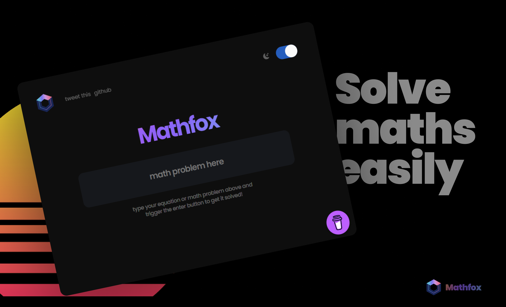
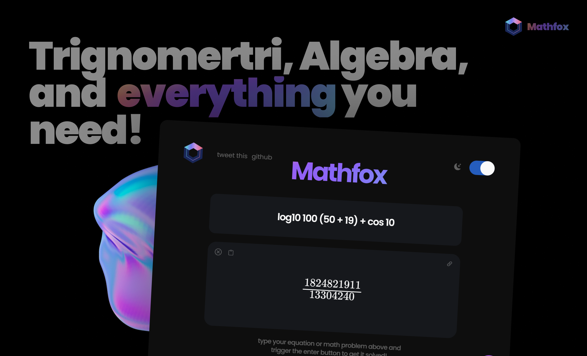
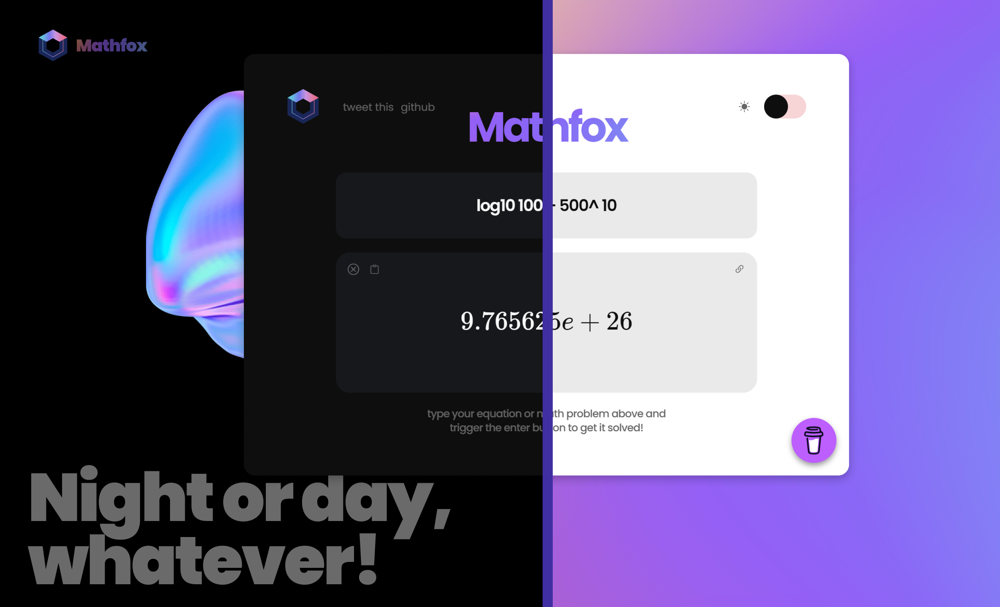

<h1 align="center">
    
   
    
   <a href="https://mathfox.vercel.app/">Mathfox</a> 
</h1>

<h4 align="center">
    Mathfox is a simple web app which lets you solve maths problems with ease. No need of symbols, LaTex or anything, Just plain text!</a> 
</h4>

 

# 📷 Screenshots

|  |  |
| ------------------------------------------- | ------------------------------------------- |
|  |  |

 

# ⚡ Supported Stuff

-   All together 100 + things you can try!

-   Trigonometry
-   Most Math functions
-   Logarithms
-   Exponents
-   Square Roots
-   Much more than you think! See [Nerdamer Docs](https://nerdamer.com/documentation.html)

# `💪` Libraries used

-   [Jquery](https://github.com/jquery/jquery)
-   [Clipboard.js](https://github.com/zenorocha/clipboard.js/)
-   [MathJax](https://github.com/mathjax/MathJax)
-   [Nerdamer](https://github.com/jiggzson/nerdamer)

# `❤️` Support

Show your support by 🌟 Starring this repo or buy me a coffee!
  
 
 

# `🛡️` Licence

Refer [LICENSE](LICENCE) for details

Made with ❤️ by <a href="https://harrytom.netlify.app/">Harry </a>

